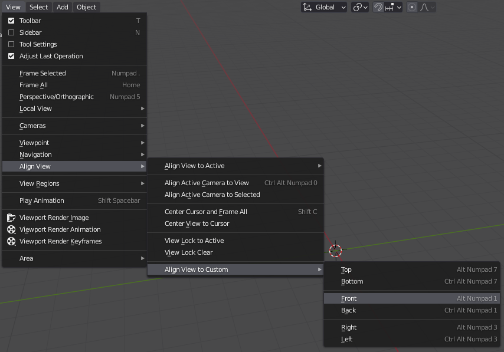
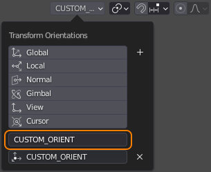
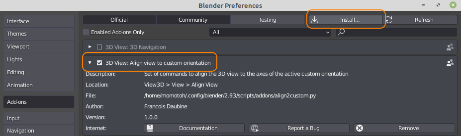

# Align2Custom

This Blender add-on allows aligning the 3D view to custom transform orientations.

## Description

In the 3D View, it's possible to align the view either to the global transform orientation, the local one, or the camera. But, since the possiblity to create a _custom transform orientation_ has been introduced in Blender, the ability to align the view to its axes has not been implemented.

This add-on is here to fix it.

Once the add-on is installed (see the _Installation_ section for instructions), a new submenu `Align View to Custom` appears in the menu `View -> Align View` of the 3D View :

If a _custom transform orientation_ has been created and is active (see how on the image below), you can align the view to one of its axes by selecting one of the submenu items :

Moreover, these items can be accessed by keyboard shortcuts as follows :
 - Top View    : `ALT` + `NUMPAD 7`
 - Bottom View : `ALT` + `CTRL` + `NUMPAD 7`
 - Front View  : `ALT` + `NUMPAD 1`
 - Back View   : `ALT` + `CTRL` + `NUMPAD 1`
 - Right View  : `ALT` + `NUMPAD 3`
 - Left View   : `ALT` + `CTRL` + `NUMPAD 3`

__Warning__ : these commands have no effect if no _custom transform orientation_ is active.

## Installation

 - Download __Align2Custom V1.0.0__ from the release section
 - Install the file __align2custom.py__ as a Blender add-on (Edit -> Preferences... -> Add-ons -> Install...)
 - Check the `Align view to custom orientation` option in the add-ons listing
 

## Upcoming Features

 - Smooth transition between starting and ending orientations.
 - Ask the user to select a _custom transform orientation_ if none is selected when calling a command of the add-on
 - Align the 3D View to the cursor axes
 - Any further idea

## Changelog

### V1.0.0

First stable release of the add-on.

