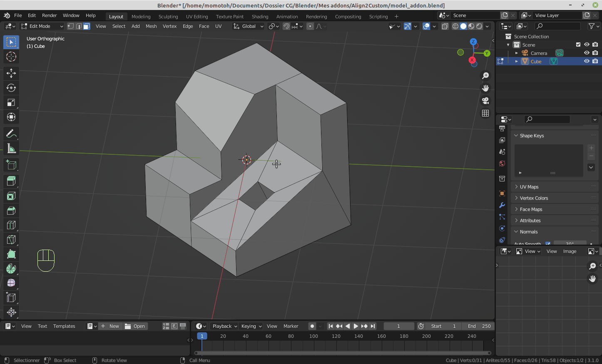
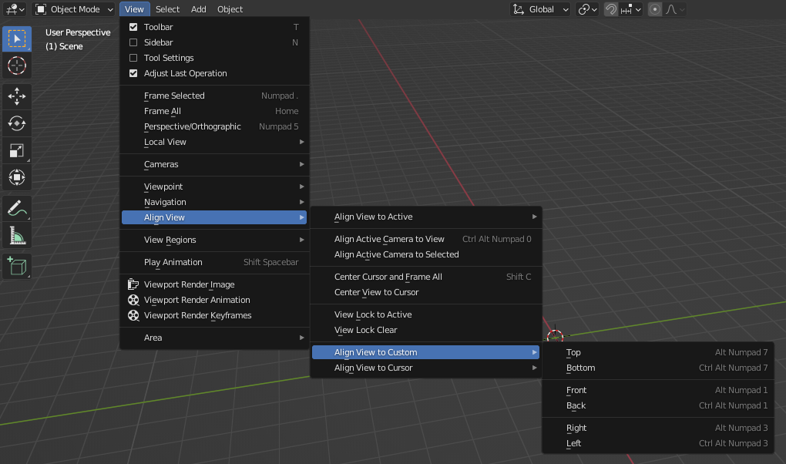

# Align2Custom

Blender incorporates 3 operators to align the 3D view :
 - alignment to the global transform orientation
 - alignment to a local transform orientation
 - alignment to the camera orientation

Most of the time these methods become limited when working on a complicated mesh or a complicated scene.

This add-on bypasses these limits by offering 2 custom alignment features for the 3D view :
 - alignment to the 3D cursor orientation
 - alignment to a custom transform orientation

 

## Features

### Alignment to the 3D cursor orientation

This method is based on the ability of the 3D cursor to automatically align itself to the geometry of a face it is snapped to.

 

#### Prerequisites and limitations

Blender provides the following operators to snap the 3D cursor to one face of a mesh : <kbd>SHIFT</kbd> + <kbd>RMB</kbd> click (on the face), the _snap menu_ (<kbd>SHIFT</kbd> + <kbd>S</kbd>), or the _Cursor_ tool. Unfortunately the first two methods don't change the 3D cursor orientation ; they merely change the cursor position.
Therefore there is no choice but to use the 3D cursor tool. However it requires a bit of configuration to work as expected.

First, it's necessary to allow the 3D cursor to align automatically to the geometry of the targeted mesh :
 - select the _Cursor_ tool in the 3D viewport toolbar
 - open the 3D viewport properties panel (keyboard shortcut <kbd>N</kbd>) and select the `Tool` thumbnail
 - in the `Active tool` section, change the `Orientation` parameter to __*Geometry*__

 

 

__Important note__ : Each work mode has its own 3D cursor configuration. Therefore, you'll have to change the 3D cursor _Orientation_ parameter for each relevant mode (Object mode, Edit mode, Sculpt mode, ...).

Second, since you need to switch to the 3D cursor tool to snap the cursor to a face, I strongly recommend assigning a keyboard shortcut (let's say <kbd>Q</kbd> for instance) to the 3D cursor tool, so as to speed up the workflow.

Click here if you want to see how...

Finally, I encourage you to save this configuration in the startup file, so that you don't have to do it again each time you start a new project.

 

#### Workflow

Once you have properly configured the 3D cursor tool, switch to it, snap the cursor to the desired face (it should be aligned to the face geometry), and switch back to the tool you were working on before.

Then, use one of the following keyboard shortcuts to align the 3D View to the 3D cursor orientation :
 - Top View    : <kbd>ALT</kbd> + <kbd>NUMPAD 8</kbd>
 - Bottom View : <kbd>ALT</kbd> + <kbd>CTRL</kbd> + <kbd>NUMPAD 8</kbd>
 - Front View  : <kbd>ALT</kbd> + <kbd>NUMPAD 5</kbd>
 - Back View   : <kbd>ALT</kbd> + <kbd>CTRL</kbd> + <kbd>NUMPAD 5</kbd>
 - Right View  : <kbd>ALT</kbd> + <kbd>NUMPAD 6</kbd>
 - Left View   : <kbd>ALT</kbd> + <kbd>CTRL</kbd> + <kbd>NUMPAD 6</kbd>

 

 

Those commands are also accessible in the `View` -> `Align View` -> `Align View to Cursor` top menu of the 3D View.

 

	
 

### Alignment to a custom transform orientation

This method is based on the Blender feature that allows to define custom transform orientations.

 

#### Preparation

To align the 3D View to a custom transform orientation, it must have been created beforehand.

My method is based on the _Normal_ transform orientation of a face or plane to define a _Custom_ transform orientation :

 

 

#### Workflow

When a _Custom_ transformation orientation is active, you can use one of the following keyboard shortcuts to align the 3D View to its axes :
 - Top View    : <kbd>ALT</kbd> + <kbd>NUMPAD 7</kbd>
 - Bottom View : <kbd>ALT</kbd> + <kbd>CTRL</kbd> + <kbd>NUMPAD 7</kbd>
 - Front View  : <kbd>ALT</kbd> + <kbd>NUMPAD 1</kbd>
 - Back View   : <kbd>ALT</kbd> + <kbd>CTRL</kbd> + <kbd>NUMPAD 1</kbd>
 - Right View  : <kbd>ALT</kbd> + <kbd>NUMPAD 3</kbd>
 - Left View   : <kbd>ALT</kbd> + <kbd>CTRL</kbd> + <kbd>NUMPAD 3</kbd>

__Note__ : these commands have no effect if no _Custom_ transform orientation is active.

 

 

Those commands are also accessible in the `View` -> `Align View` -> `Align View to Custom` top menu of the 3D View.

 

 

## Installation

This addon can be installed in two differents ways.

### Installation from Github

This method is recommended for Blender versions prior to 4.2 :
 - Download ZIP file of [Align2Custom V2.1.0](https://github.com/fdaubine/Align2Custom/releases/tag/V2.1.0) from the release section
 - Open Blender, then drag and drop the ZIP file onto Blender UI to install the add-on
 - Check that the `Align 2 Custom` option appears in the list of add-ons (`Edit` -> `Preferences...` -> `Add-ons`)

### Installation from Blender Extensions platform

Since 4.2 version, Blender can connect to an online platform called __Blender Extensions__ to download and install tons of add-ons. This add-on is now available on this platform. To install it, follow these instructions :
- Look for __Align2Custom__ add-on on [Blender Extensions](https://extensions.blender.org/)
- Follow the [installation instructions](https://extensions.blender.org/about/)
- In Blender, check that the `Align 2 Custom` option appears in the list of add-ons (`Edit` -> `Preferences...` -> `Add-ons`)

This method is recommended for Blender 4.2 (and newer) because add-on update can be managed easily and directly from Blender UI whenever a new version of the add-on is published.

### add-on preferences

If you prefer hard transitions or if you're facing problems (odd behaviors, performance, ...), the add-on installation panel provides an option to disable the smooth transition during the 3D View alignment.

 

 

## Changelog

### V2.1.0

Packaging optimization for publication on __Blender Extensions__ platform.
No functional evolution nor bug fixing.
No need to update to this version if you run a Blender version prior to __4.2__.

### V2.0.1

Bug correction (Issue #3) for Blender 4.0 compatibility.

### V2.0.0

New feature : align the 3D view to the 3D cursor orientation.
Improvement : smooth alignment transitions.

### V1.0.0

First stable release.
Only feature : align the 3D view to a custom orientation.

